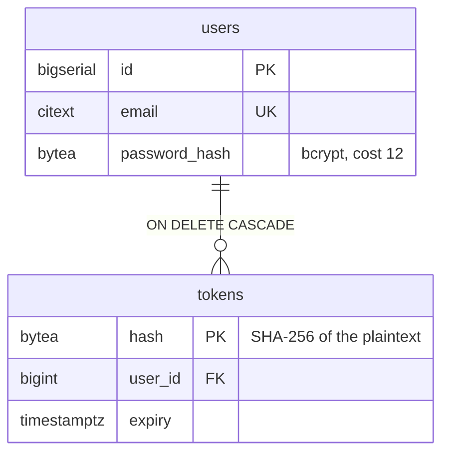
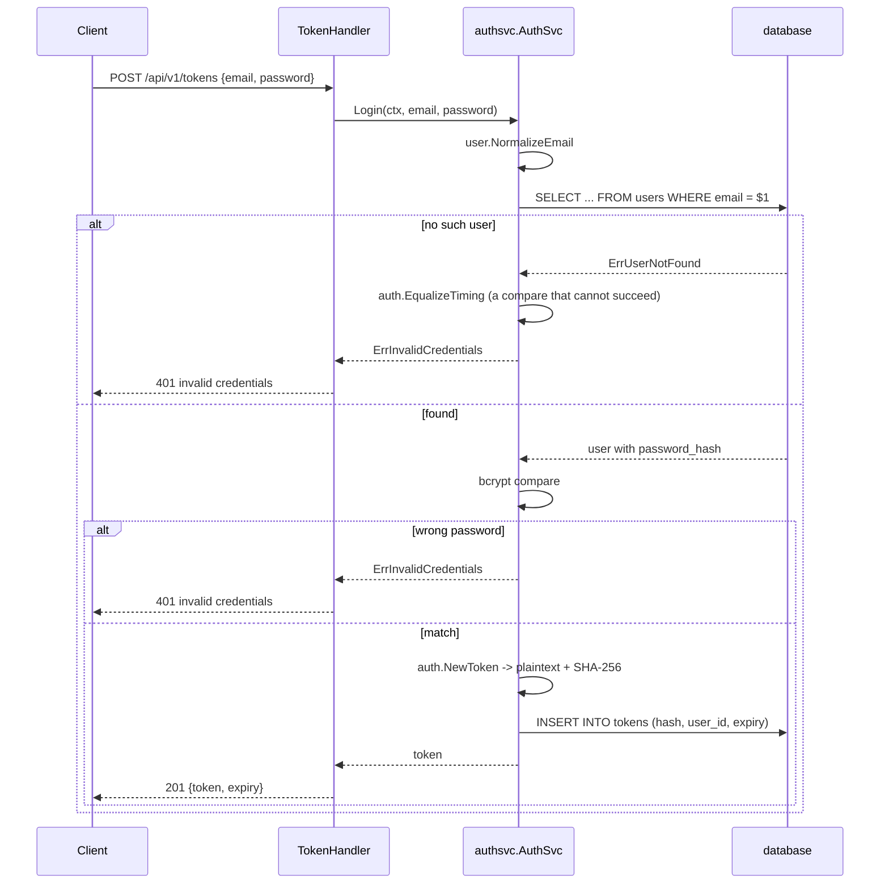
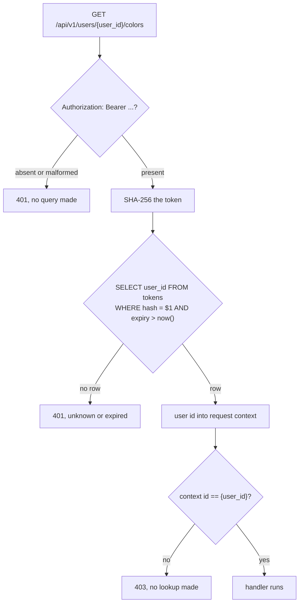

<!-- markdownlint-disable MD031 -->

## Auth

Using stateful bearer tokens.

Two wrappers:

| Q                  | Wrapper        | Reads                      | Refuses with |
| ------------------ | -------------- | -------------------------- | ------------ |
| Who is calling     | `authenticate` | the `Authorization` header | 401          |
| May they have this | `requireOwner` | `{user_id}` in the path    | 403          |

### How db looks

We don't store what a client sends.
A password is `bcrypt`, a token is `SHA-256`. The plaintext token exists only in the login response. A db leak would not give any tokens that can be used to log in.

A token carries at least 128 bits from `crypto/rand.Text`.

### Login

`POST /api/v1/tokens` is public, the only endpoint that reads `password_hash`.

An unknown email, invalid email and a wrong password answer with the same status, same body, and spend the same amount of time (see `EqualizeTiming`). So client would not know what emails are registered.

### An authenticated request

The two wrappers are applied at the route line (`internal/server/routes.go`), not inside the middleware chain:

- we don't know the `req.PathValue` until `ServeMux` has matched
- endpoints like `/livez` are not wrapped and don't use storage

First wrapper validates token, second checks that the permission is allowed. Second one does not use repo, just checks token user_id vs the route path. 403 cannot leak whether the user in the path exists.

See `internal/server/auth.go`.

### Future

Logout, token revocation, password change/reset, expired tokens cleanup
