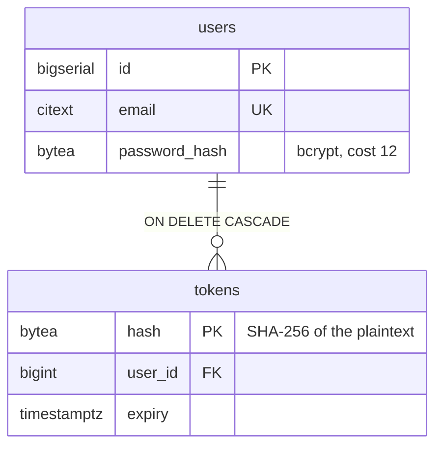
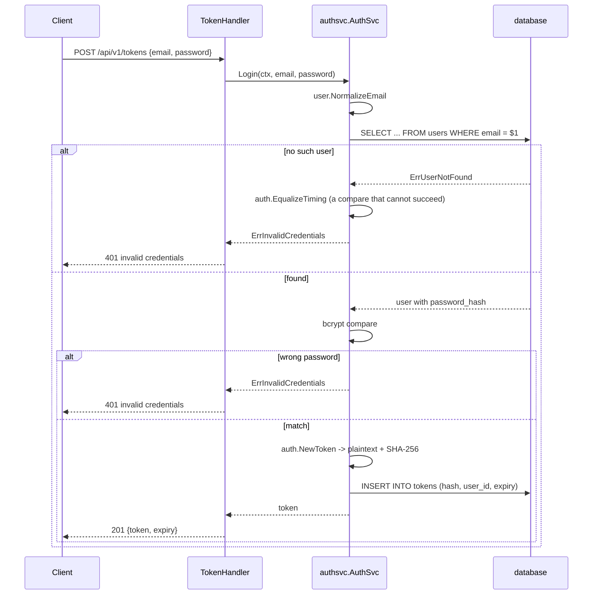
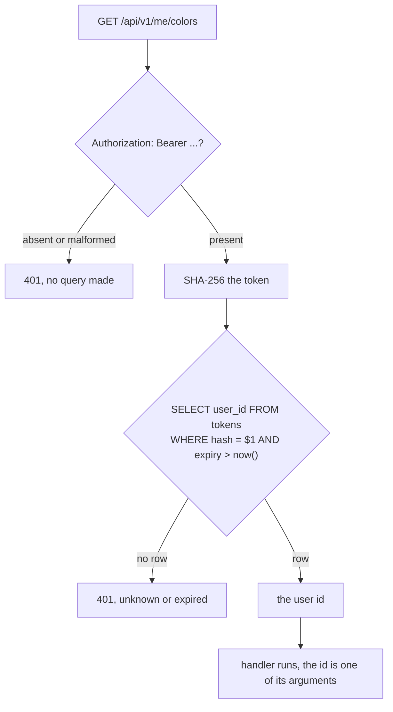

<!-- markdownlint-disable MD031 -->

## Auth

Using stateful bearer tokens.

One wrapper:

| Q              | Wrapper        | Reads                      | Refuses with |
| -------------- | -------------- | -------------------------- | ------------ |
| Who is calling | `authenticate` | the `Authorization` header | 401          |

Every per-user route is `/api/v1/me/...`.

### How db looks

We don't store what a client sends.
A password is `bcrypt`, a token is `SHA-256`. The plaintext token exists only in the login response. A db leak would not give any tokens that can be used to log in.

A token carries at least 128 bits from `crypto/rand.Text`.

### Login

`POST /api/v1/tokens` is public, the only endpoint that reads `password_hash`.

The response is only the token. Info about who is logged in - `GET /api/v1/me`.

An unknown email, invalid email and a wrong password answer with the same status, same body, and spend the same amount of time (see `EqualizeTiming`).
So a client would not know what emails are registered.

### Logout

`DELETE /api/v1/tokens` revokes the token that the this request carries.

Revoking is just deleting the row.

### An authenticated request

The wrapper is applied at the route line (`internal/server/routes.go`), not inside the middleware
chain: endpoints like `/livez` are not wrapped and don't use storage.

The wrapper takes an `authedHandlerFunc` (`func(w, r, user.ID)`) and returns a `http.Handler`.

See `internal/server/auth.go`.

### Future

Revoking all of a user's tokens, password change/reset, expired token cleanup.
