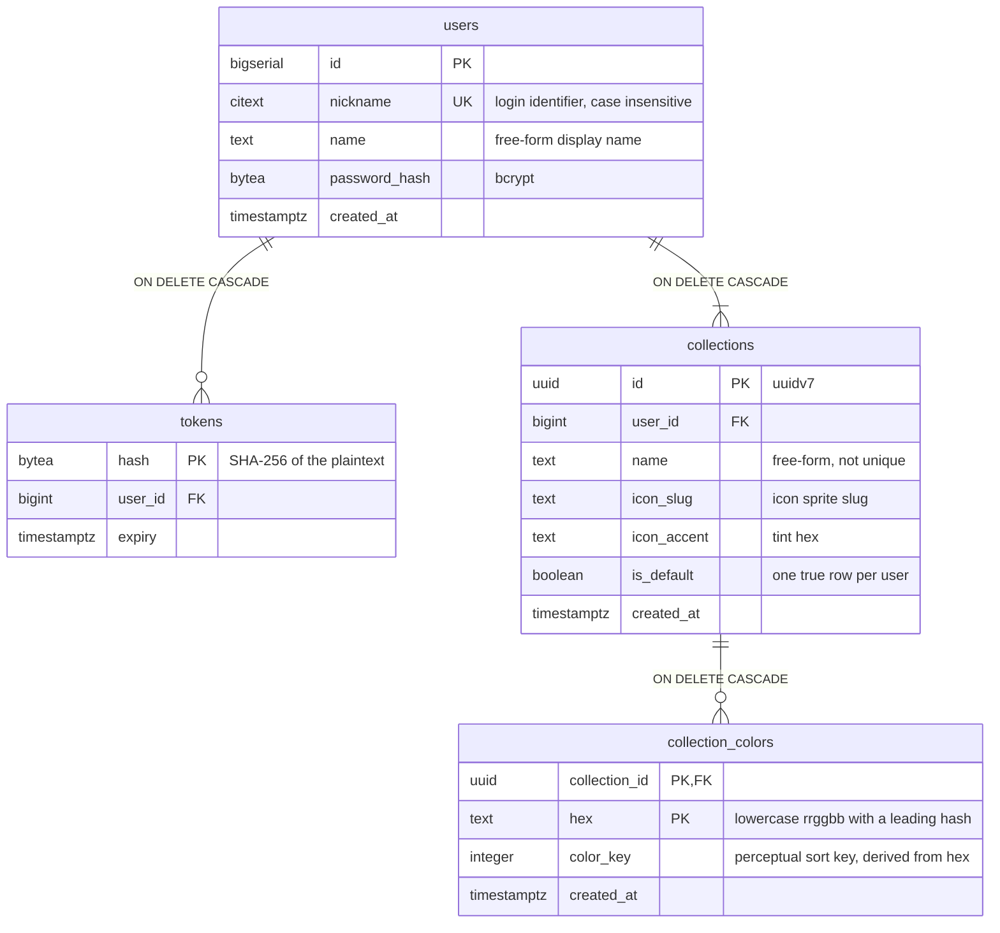

## Data model

### Tables

`users` is the account. No email column for now, so there is no account
recovery.

`tokens` is the bearer session. See [auth.md](auth.md).

`collections` is the once collection.

`collection_colors` is a saved color. The key is `(collection_id, hex)` instead of its own id.

### Indexes

| Index                                  | On                                       | Does                                            |
| -------------------------------------- | ---------------------------------------- | ----------------------------------------------- |
| `collections_one_default_per_user`     | `collections (user_id) WHERE is_default` | one default per account, and the default lookup |
| `collection_colors_created_at_hex_idx` | `(collection_id, created_at, hex)`       | `sort=created_at`, keyset paging                |
| `collection_colors_color_key_hex_idx`  | `(collection_id, color_key, hex)`        | `sort=color`, keyset paging                     |

`sort=hex` needs no index: the PK is already a btree on `(collection_id, hex)`.

Both secondary indexes carry `hex` as the tiebreak.
