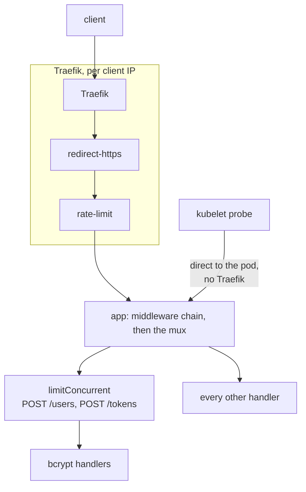
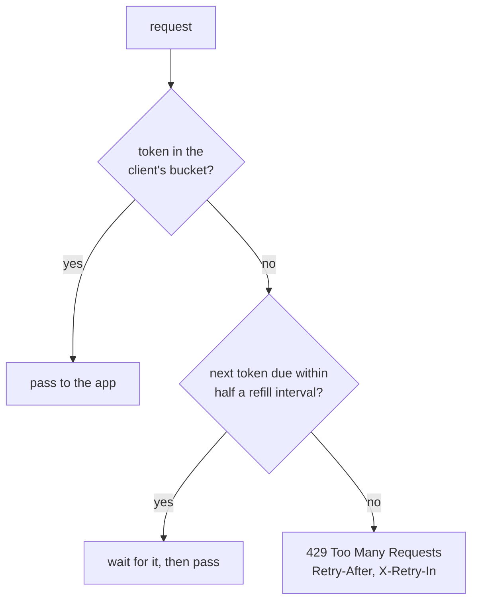
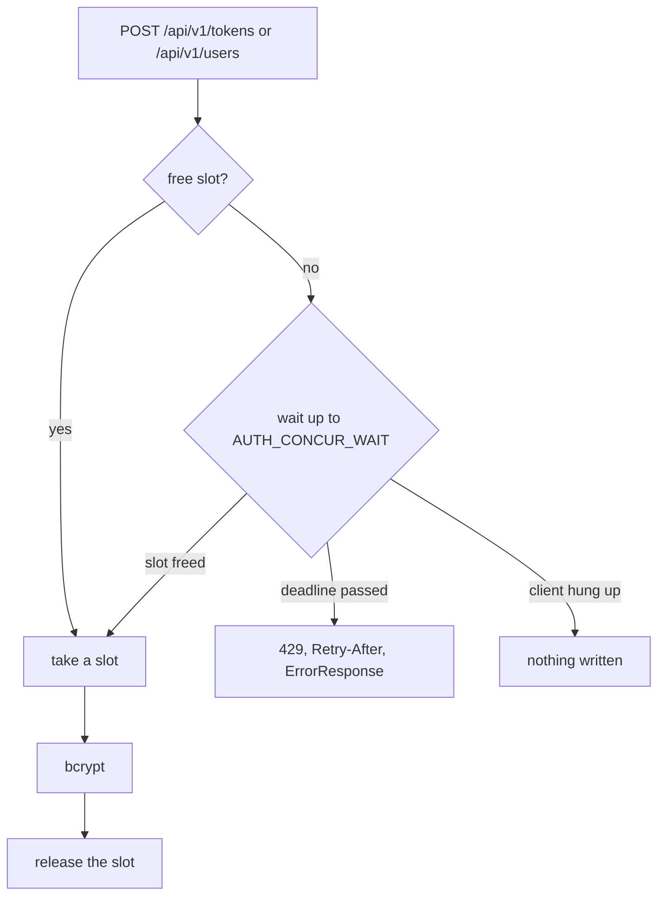

## Rate limiting

Two limits, at two layers:

| Limit           | Where                   | Keyed on              | Covers                                      | Refuses with         |
| --------------- | ----------------------- | --------------------- | ------------------------------------------- | -------------------- |
| Rate limit      | Traefik, on the Ingress | client IP             | every route                                 | 429, plain text      |
| Concurrency cap | app, route line         | nothing, a slot count | `POST /api/v1/users`, `POST /api/v1/tokens` | 429, `ErrorResponse` |

### Edge: per-IP rate limit

A Traefik `rateLimit` Middleware (token bucket like).
The Ingress applies it after `redirect-https`, a plain HTTP request is redirected without
spending a token.

The 429 comes from Traefik: plain text body, not in `api.yaml`.

**The key is the connection's remote address** (`ipStrategy.depth: 0`).

The remote address is the real client only if `traefikSourceIP` is applied
(`externalTrafficPolicy: Local` on the k3s Traefik Service). Without it every client arrives as
the node address `10.42.0.1` and shares one bucket.

### App: concurrency cap on bcrypt

`POST /api/v1/users` and `POST /api/v1/tokens` run bcrypt, a few hundred ms of CPU.

Both routes share one semaphore: at most `AUTH_CONCUR_LIMIT` bcrypt requests run at once,
across all clients. It caps CPU, not request rate.

### Local

Compose has no Traefik, so only in app limits apply.
